# AWS Infrastructure Analyzer Report

## 1) Quick Summary
- **Networking:** 4 VPCs, 21 Subnets, 4 IGWs. Standard multi-VPC setup detected.
- **Compute:** 5 EC2 instances (distributed across reservations).
- **Storage:** 8 EBS Volumes (attached to compute logic) and 9 S3 Buckets.
- **Databases:** 1 RDS Instance provisioned.
- **Security & Access:** 23 Security Groups and 33 IAM Roles.
- **Cost Allocation (FinOps):** 4 Elastic IPs allocated. Needs validation if any are unattached (billing leak).

## 2) Full Inventory
### A) Accounts & governance
- **Account Layout:** Single account scope audited. No AWS Organizations data extracted in this run.

### B) Identity & access
- **IAM Roles:** 33 active IAM roles. Recommend reviewing role trust policies to ensure least privilege.

### C) Networking
- **VPCs:** 4 isolated Virtual Private Clouds.
- **Subnets:** 21 subnets indicating a mix of public/private tiers across Availability Zones.
- **Gateways:** 4 Internet Gateways (1 per VPC usually indicates public internet access across all VPCs).
- **Public IPs:** 4 Elastic IPs provisioned.

### D) Edge & traffic management
- **Load Balancers:** No Elastic Load Balancers (ALB/NLB) detected in this specific AWS CLI dump. Consider checking if EC2 instances are directly exposed.

### E) Compute & orchestration
- **EC2 Instances:** 5 Virtual Machines running.

### F) Data & storage
- **S3 Buckets:** 9 object storage buckets.
- **EBS Volumes:** 8 block storage volumes backing the EC2 instances.
- **Databases:** 1 Relational Database Service (RDS) instance.

### H) Security services & posture
- **Security Groups:** 23 security groups controlling inbound/outbound traffic.

---

## 3) Architecture Diagram (Mermaid)

```mermaid
architecture-beta
    group aws(cloud)[AWS Cloud]
    
    group vpc_main(network)[Main Workload VPC] in aws
    group sub_public(network)[Public Subnet] in vpc_main
    group sub_private(network)[Private Subnet] in vpc_main

    service igw(internet)[Internet Gateway] in vpc_main
    
    service ec2_group(server)[5x EC2 Instances] in sub_public
    service rds_db(database)[1x RDS Instance] in sub_private
    
    service s3_storage(disk)[9x S3 Buckets] in aws

    igw:B -- T:ec2_group
    ec2_group:R -- L:rds_db
    ec2_group:T -- B:s3_storage
```

---

## 4) Well-Architected & FinOps Findings

### Security Pillar
- **Finding 1 (Security Groups):** 23 Security Groups for 5 EC2 instances and 1 RDS is a high ratio. 
  - *Action:* Audit rules for `0.0.0.0/0` (open to the world) on SSH (22) or RDP (3389).
- **Finding 2 (Direct Internet Access):** EC2 instances might be directly in public subnets rather than behind a Load Balancer.
  - *Action:* Move compute to private subnets and use Application Load Balancers or Systems Manager (SSM) for access.

### Cost Optimization (FinOps)
- **Finding 1 (Elastic IPs):** 4 Elastic IPs for 5 instances. 
  - *Action:* Verify if any Elastic IP is currently **unattached**. AWS charges hourly for unattached Elastic IPs.
- **Finding 2 (EBS Volumes):** 8 Volumes for 5 instances.
  - *Action:* Check if 3 of those volumes are unattached (orphaned). Delete unattached volumes to stop paying for unused block storage.
- **Finding 3 (Right-Sizing):** 
  - *Action:* Review CloudWatch CPU metrics for the 5 EC2 instances and the RDS instance. If CPU < 15% consistently, downsize the instance type (e.g., from `t3.large` to `t3.medium`).

### Reliability & Performance
- **Finding 1 (Single Points of Failure):** Only 1 RDS instance detected.
  - *Action:* For production databases, ensure "Multi-AZ" is enabled on the RDS instance to guarantee automatic failover.

---

## 5) Remediation Plan (Prioritized)

**[P0 - Critical] Security & Waste**
- Run `aws ec2 describe-addresses` and release any Elastic IP not attached to an ENI.
- Run `aws ec2 describe-volumes` and delete available/unattached EBS volumes (save unused costs).
- Audit the 23 Security Groups to close administrative ports to the public internet.

**[P1 - High] Architecture Hardening**
- Convert the RDS database to Multi-AZ if it stores critical production data.
- Enable S3 Block Public Access on all 9 S3 buckets.

**[P2 - Medium] Operational Excellence**
- Implement cost allocation tags (Environment, Project, Owner) to the EC2 and RDS instances.

---

## 6) Validation Checklist
- [ ] Orphaned EBS volumes deleted.
- [ ] Unattached Elastic IPs released.
- [ ] Security Groups audited for `0.0.0.0/0`.
- [ ] S3 buckets verified for public access blocks.
